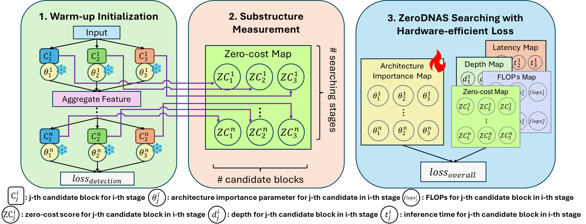

# WZDNAS: Warm-up Strategies for Zero-Cost Differentiable NAS in Hardware Application Optimization
## Overview


## Abstract
Neural Architecture Search (NAS), designed to discover optimal network structures within specific model complexity constraints, is a time-intensive process, especially for tasks like object detection. Differentiable-based NAS (DNAS) improves efficiency by relaxing the search space, but it still demands considerable time due to the necessity of training the SuperNet. Combining zero-cost proxies offers a solution by ranking architectures without requiring training, significantly speeding up the search process and reducing resource consumption. However, zero-cost rankings are sensitive to SuperNet initialization, leading to unstable searches. Moreover, previous NAS methods for object detection have not adequately considered real-world device implementation, making the search results less suitable for specific edge devices. To tackle these issues, we propose WZDNAS, which optimizes the stability and robustness of combining DNAS and zero-cost proxies and is more suitable for hardware applications. By incorporating SuperNet warm-up initialization and hardware-efficient loss, we improve the stability of the algorithm, making it possible to discover models with smaller sizes and faster inference speeds that are optimized for edge devices. Our experiments in object detection demonstrate that the architectures discovered by WZDNAS are competitive and outperform both manually designed models and other NAS methods.

## Dataset File Structure
```
WZDNAS
└── data
    ├── coco  (Link)
    └── VOC2007 (Link) 

```
## Execution Step
### Searching Phase
#### 1. Set Environment
Enviroment file: requirement.yaml(./requirement.yaml)
#### 2. Search comment
 - WZDNAS(normal) searching (with warm-up phase and hardware-aware loss)
 
```python ./tools/train_izdnas_all.py --cfg config/search/izdnasV4-P5-S42.yaml --data ./config/dataset/voc_dnas.yaml --hyp ./config/training/hyp.zerocost.yaml --model config/model/Search-YOLOv4-P5.yaml --device 6 --exp_name EXP_NAME --nas DNAS-70 --zc naswot --lookup config/lookup/p5_rb5_gpu.yaml```
    - ```--cfg```: training parameter setting
    - ```--data```: dataset
    - ```--hyp```: hyperparameters
    - ```--model```: model architecture templet file
    - ```--nas```: target FLOPs
    - ```--zc```: zero-cost proxy
    - ```lookup```: look-up table

#### WZDNAS(speed-up)
Detail in ```dw``` branch

### Training Phase (ScaledYOLOv4)
For details and code can refer from our [ScaledYOLOv4 gihub](https://github.com/B106Roger/ScaledYOLOv4-NAS/tree/normal).
#### Clone the repository
``` git clone https://github.com/B106Roger/ScaledYOLOv4-NAS.git -b normal```
#### Train the model
```python train.py --batch-size 32 --img-size 416 --data voc.yaml --hyp ./data/hyp.finetune.yaml --cfg ./models/yolov4-csp.yaml --weights '' --device 3,4 --name EXP_NAME```
#### Test the model
```python test.py --img 416 --conf 0.001 --batch 8 --device 5 --data voc.yaml --weights BEST_WEIGHT.pt```


